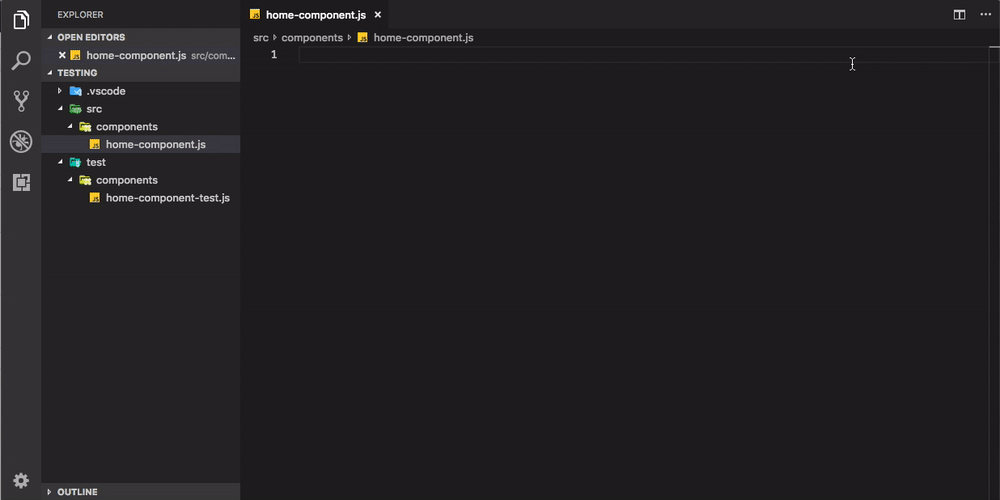

# test-file-finder README



This extension `test-file-finder` is useful for quickly finding and opening test files.
The current keybinding is Cmd + F1, but I am taking suggestions for what would be better.
I currently only have support for Javascript & Ruby, check below for tips on adding configuration for any other test files.

Add the extension [here](https://marketplace.visualstudio.com/items?itemName=riegledevin.test-file-finder)

The default globs for finding spec files are:
Javascript: `-test.js`
Ruby: `_spec.rb`

## Current configuration:

| Name | Default |
| -- | -- |
| `testFinder.showInStatusBar` | `false` |
| `testFinder.csharpGlob` | `Tests.cs` |
| `testFinder.javascriptGlob` | `-test.js` |
| `testFinder.rubyGlob` | `_spec.rb` |

*showInStatusBar shows a message on the left side of the status bar to indicate whether it has found the test file or not*


## Adding support for new test files
You can add support for new test files by adding your configuration to the package.json file.
You need to use this format:

```json
"contributes" {
  "configuration": {
    "title": "Test File Finder Configuration",
    "properties": {
      "testFinder.<languageId>Glob": {
        "type": "string",
        "default": "<append-to-file-name>",
        "description": "..."
      }
    }
  }
}
```

[You can find the supported languageId values here](https://code.visualstudio.com/docs/languages/identifiers)
